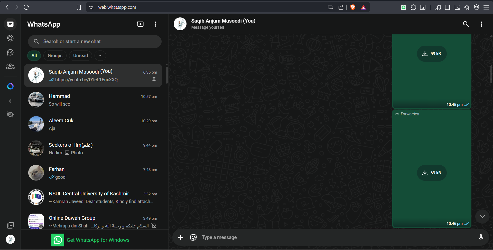
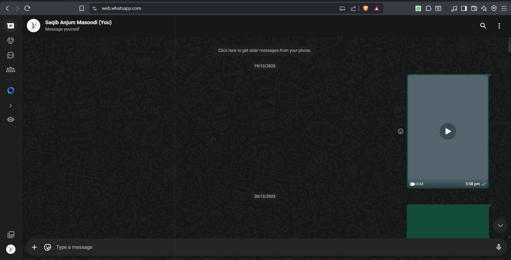
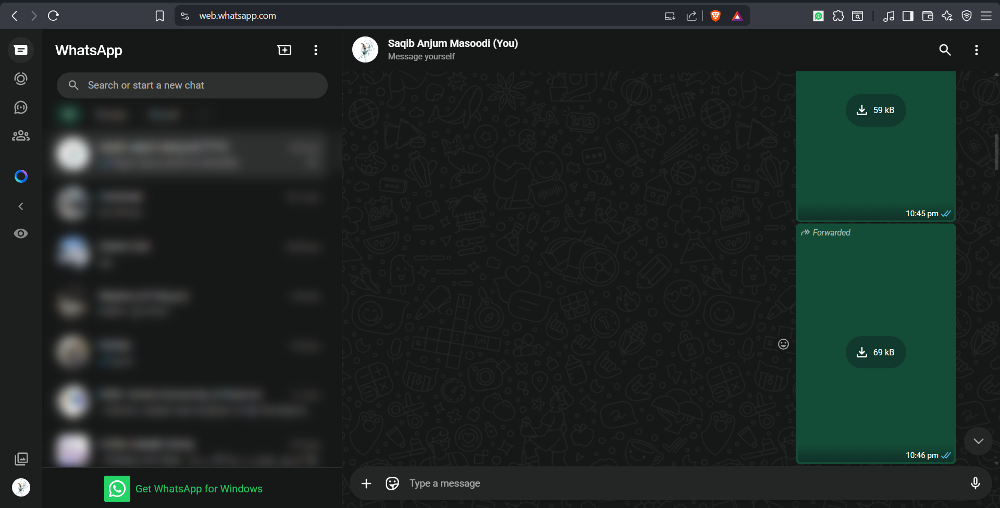

# WA-Focus — WhatsApp Sidebar Toggle

WA-Focus is a lightweight productivity browser extension designed to help you stay focused while using WhatsApp Web. It allows you to toggle the visibility of the sidebar and blur its content for a cleaner, distraction-free messaging experience.

## Visuals

| Normal View | Collapsed View | Blurred View |
| :---: | :---: | :---: |
|  |  |  |

## Features

- **Sidebar Toggle**: Instantly hide or show the WhatsApp sidebar to maximize your chat workspace.
- **Privacy Blur**: Apply a soft blur to the sidebar content, hiding contact names and message previews while keeping the navigation accessible.
- **Persistent State**: Your collapse and blur preferences are automatically saved and restored when you reload WhatsApp.
- **Resilient UI Controls**: Toggles are seamlessly injected into the WhatsApp icon panel and are built to withstand WhatsApp's randomized CSS class updates.
- **Micro-Animations**: Smooth transitions when expanding or collapsing the sidebar.

## Keyboard Shortcuts

| Action | Shortcut |
| :--- | :--- |
| **Toggle Sidebar** | `Ctrl + \` |
| **Toggle Blur** | `Ctrl + Shift + B` |

## Installation

1. Clone or download this repository.
2. Open your browser and navigate to the Extensions page:
   - **Chrome**: `chrome://extensions`
   - **Edge**: `edge://extensions`
3. Enable **Developer mode** (usually a toggle in the top-right corner).
4. Click **Load unpacked** and select the directory containing this extension.
5. Open [web.whatsapp.com](https://web.whatsapp.com/) and enjoy your focused workspace!

## Technical Details

- **Manifest V3**: Complies with the latest Chrome extension standards.
- **Performance**: Zero dependencies and minimal footprint.
- **Smart DOM Observation**: Uses `MutationObserver` to ensure reliable operation in WhatsApp's dynamic single-page application (SPA) environment.
- **Selector Longevity**: Avoids brittle class-name selectors (which WhatsApp randomizes), relying instead on stable attributes like `id`, `aria-label`, and `role`.

## License

This project is open-source and available under the MIT License.
